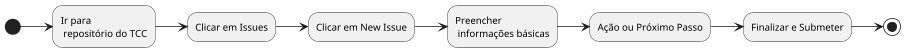

# Como Registrar uma Reunião de Orientação de TCC

Este guia irá orientá-lo passo a passo sobre como registrar uma reunião de orientação de TCC de forma clara e organizada no GitHub, utilizando o formato de *Issue*. O registro é uma parte importante para acompanhar seu progresso e garantir que todas as decisões e tarefas estejam devidamente documentadas.

Caso queira, é possível visualizar um já preenchido clicando [aqui](./exemplos/memoria-reuniao-ex01.md).

---

## Passos para Registrar uma Reunião

### 1. Criação de uma Nova Issue

1. Acesse o repositório do seu TCC no GitHub.
2. Clique na aba **Issues** no topo da página.
3. Clique no botão verde **New Issue**.

### 2. Preenchendo as Informações da Issue

Ao criar a nova issue, preencha os campos com as informações solicitadas, conforme descrito abaixo.

#### Título da Issue

O título da issue deve seguir o formato abaixo:

> `[Reunião] - Nome do Aluno - AAAA-MM-DD`

Sendo:
- **Nome do Aluno:** Seu nome completo.
- **AAAA-MM-DD:** A data da reunião no formato ano-mês-dia.

**Exemplo:**

> [Reunião] - João da Silva - 2025-04-12

#### Corpo da Issue

No corpo da issue, preencha as informações conforme os seguintes tópicos:

### 👨‍🏫 Orientador(a)
- **Nome completo:** O nome do seu orientador. 
- Exemplo: `Prof. Francisco Rodrigues`.

### 📅 Detalhes da Reunião
- **Data:** Preencha com a data da reunião, no formato `AAAA-MM-DD`.
- **Modo:** Se a reunião foi presencial ou remota.
- **Local/Plataforma:** O local onde a reunião ocorreu, como "Lab 01" ou "Google Meet".

### 📌 Temas Abordados
Marque os tópicos discutidos durante a reunião. Utilize as caixas de seleção para indicar os temas abordados. Caso algum tema não esteja na lista, marque "Outro" e descreva o tópico.

- [ ] Escolha/ajuste do tema  
- [ ] Objetivo geral / objetivos específicos  
- [ ] Justificativa  
- [ ] Metodologia  
- [ ] Referencial teórico  
- [ ] Cronograma  
- [ ] Modelagem / Documentação  
- [ ] Revisão textual / formatação  
- [ ] Apresentação do trabalho  
- [ ] Outro: __Especifique o tema__

### 📝 Comentários Gerais
Neste campo, escreva um resumo dos pontos discutidos na reunião, decisões tomadas e quaisquer observações importantes.

> **Exemplo:**
>
> A reunião foi produtiva. O aluno revisou o cronograma e ajustou o prazo para a entrega da metodologia. A justificativa será revisada para maior clareza.

### 🚀 Ação ou Próximo Passo
Escreva os próximos passos ou as ações que você, como aluno, deve realizar após a reunião. Isso pode incluir tarefas a serem realizadas até a próxima reunião.

> **Exemplo:**
>
> O aluno irá revisar os objetivos específicos e enviar a versão revisada até a próxima reunião.

### 🧑‍🎓 Aluno
- **Nome completo:** Coloque o seu nome completo como aluno.

---

